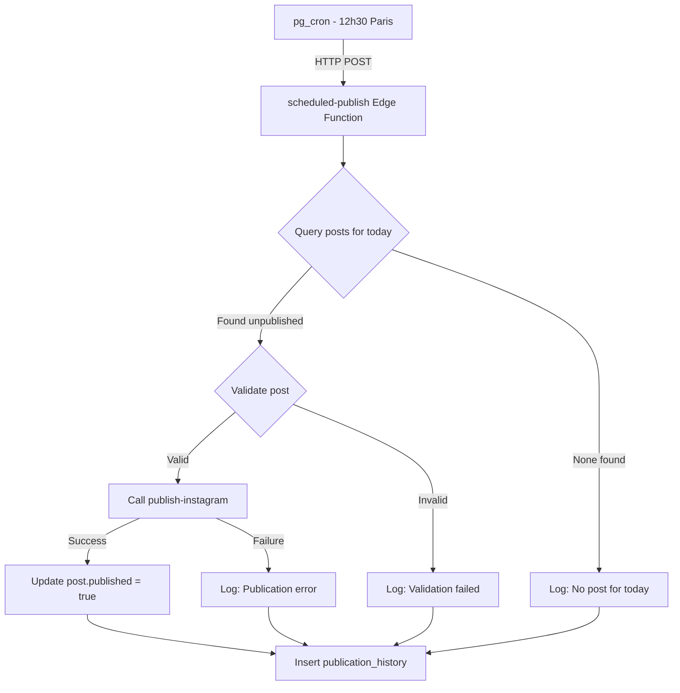

# Design Document: Scheduled Instagram Posting

## Overview

Ce système automatise la publication quotidienne sur Instagram à 12h30 (heure de Paris). Il s'appuie sur l'infrastructure Supabase existante (Edge Functions, base de données) et utilise pg_cron pour le scheduling.

Le flux est simple :
1. pg_cron déclenche une Edge Function à 12h30
2. La fonction identifie le post du jour (date = aujourd'hui, non publié)
3. Validation du post (image valide, caption non vide, pas client-managed)
4. Appel à la fonction `publish-instagram` existante
5. Mise à jour du statut et logging

## Architecture



## Components and Interfaces

### 1. Edge Function: `scheduled-publish`

Nouvelle fonction Supabase qui orchestre la publication automatique.

```typescript
interface ScheduledPublishRequest {
  // Optionnel: permet de forcer une date spécifique (pour tests)
  targetDate?: string; // Format "DD/MM"
}

interface ScheduledPublishResponse {
  success: boolean;
  action: 'published' | 'skipped' | 'no_post' | 'error';
  postId?: string;
  message: string;
}
```

### 2. Post Selection Logic

```typescript
interface PostSelector {
  // Retourne le premier post non publié pour la date donnée
  findTodaysPost(date: string): Promise<Post | null>;
}

// Implémentation
async function findTodaysPost(targetDate: string): Promise<Post | null> {
  const { data, error } = await supabase
    .from('posts')
    .select('content')
    .eq('content->>date', targetDate)
    .eq('content->>published', false)
    .eq('content->>isClientManaged', false)
    .order('id', { ascending: true })
    .limit(1)
    .single();
  
  return data?.content || null;
}
```

### 3. Post Validator

```typescript
interface ValidationResult {
  valid: boolean;
  reason?: string;
}

function validatePost(post: Post): ValidationResult {
  // Check imageUrl exists and is not base64
  if (!post.imageUrl || post.imageUrl.startsWith('data:')) {
    return { valid: false, reason: 'Invalid or missing imageUrl' };
  }
  
  // Check caption is not empty
  if (!post.caption || post.caption.trim() === '') {
    return { valid: false, reason: 'Empty caption' };
  }
  
  // Check not client-managed
  if (post.isClientManaged) {
    return { valid: false, reason: 'Client-managed post' };
  }
  
  return { valid: true };
}
```

### 4. Publication History Logger

```typescript
interface PublicationHistoryEntry {
  id: string;
  post_id: string | null;
  action: 'published' | 'skipped' | 'no_post' | 'error';
  message: string;
  created_at: string;
}
```

## Data Models

### Table: `publication_history`

Nouvelle table pour l'audit des publications automatiques.

```sql
CREATE TABLE publication_history (
  id UUID PRIMARY KEY DEFAULT gen_random_uuid(),
  post_id TEXT,
  action TEXT NOT NULL CHECK (action IN ('published', 'skipped', 'no_post', 'error')),
  message TEXT NOT NULL,
  target_date TEXT NOT NULL,
  created_at TIMESTAMPTZ DEFAULT NOW()
);

-- Index pour les requêtes par date
CREATE INDEX idx_publication_history_date ON publication_history(target_date);
```

### pg_cron Configuration

```sql
-- Activer l'extension pg_cron (si pas déjà fait)
CREATE EXTENSION IF NOT EXISTS pg_cron;

-- Créer le job pour 12h30 Paris time
-- Note: pg_cron utilise UTC, donc 12h30 Paris = 11h30 UTC (hiver) ou 10h30 UTC (été)
-- On utilise une approche qui appelle la fonction et laisse la fonction gérer le timezone

SELECT cron.schedule(
  'daily-instagram-publish',
  '30 11 * * *',  -- 11h30 UTC = 12h30 Paris (heure d'hiver)
  $$
  SELECT net.http_post(
    url := 'https://xczeyrugggausivlyfjb.supabase.co/functions/v1/scheduled-publish',
    headers := '{"Authorization": "Bearer SERVICE_ROLE_KEY"}'::jsonb,
    body := '{}'::jsonb
  );
  $$
);
```

## Correctness Properties

*A property is a characteristic or behavior that should hold true across all valid executions of a system—essentially, a formal statement about what the system should do. Properties serve as the bridge between human-readable specifications and machine-verifiable correctness guarantees.*

### Property 1: Post Selection by Date

*For any* set of posts and target date, the scheduler SHALL return only the first unpublished, non-client-managed post whose date matches the target date, or null if none exists.

**Validates: Requirements 1.1, 1.2, 1.3, 1.4**

### Property 2: Invalid Post Rejection

*For any* post with an invalid imageUrl (empty, null, or base64-encoded) OR an empty caption, the validator SHALL return invalid and the post SHALL NOT be published.

**Validates: Requirements 3.1, 3.2**

### Property 3: Client-Managed Post Exclusion

*For any* post where isClientManaged is true, the scheduler SHALL skip automatic publication regardless of other criteria.

**Validates: Requirements 3.3**

### Property 4: Publication Status Update

*For any* successful publication, querying the post immediately after SHALL return published=true.

**Validates: Requirements 2.2**

### Property 5: Failed Publication Preserves State

*For any* failed publication attempt, the post's published status SHALL remain false.

**Validates: Requirements 2.3**

### Property 6: Audit Trail Completeness

*For any* scheduler execution (success, skip, or error), a corresponding entry SHALL exist in publication_history with the correct action and timestamp.

**Validates: Requirements 4.3**

## Error Handling

| Scenario | Action | Log Level |
|----------|--------|-----------|
| No post for today | Skip, log info | INFO |
| Post already published | Skip, log info | INFO |
| Invalid imageUrl | Skip, log warning | WARN |
| Empty caption | Skip, log warning | WARN |
| Client-managed post | Skip, log info | INFO |
| Instagram API error | Retain unpublished, log error | ERROR |
| Database error | Retry once, then log error | ERROR |

## Testing Strategy

### Unit Tests
- Test `findTodaysPost` with various date formats
- Test `validatePost` with edge cases (empty strings, null values, base64 images)
- Test date formatting for Paris timezone

### Property-Based Tests
- Use fast-check (TypeScript PBT library)
- Minimum 100 iterations per property
- Generate random posts with various states
- Test selection logic with multiple posts per date

### Integration Tests
- Test full flow with mock Instagram API
- Verify database updates after publication
- Verify publication_history entries

### Test Configuration
```typescript
// fast-check configuration
fc.configureGlobal({ numRuns: 100 });
```
